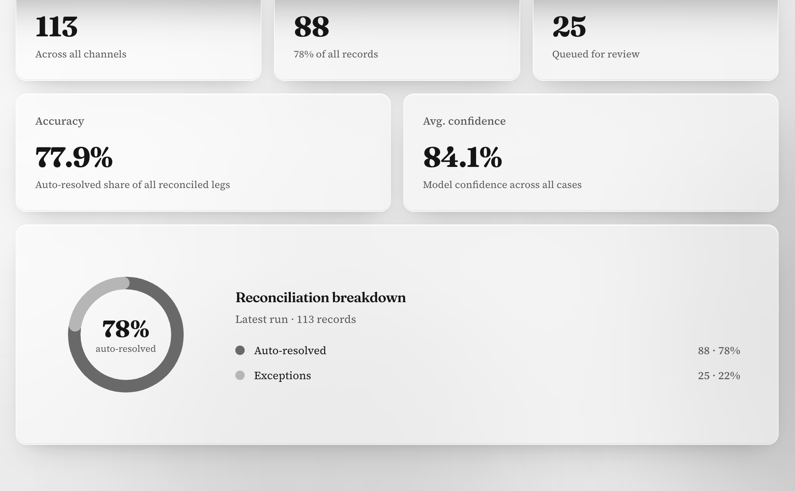
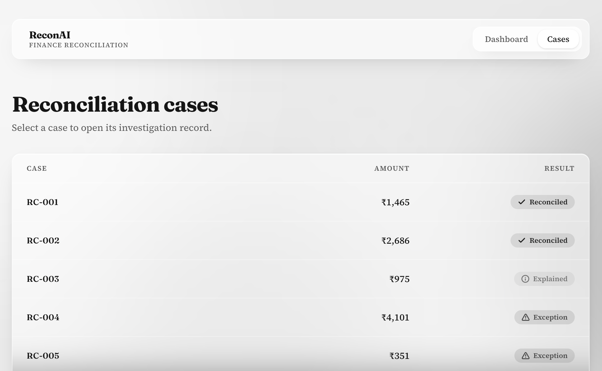
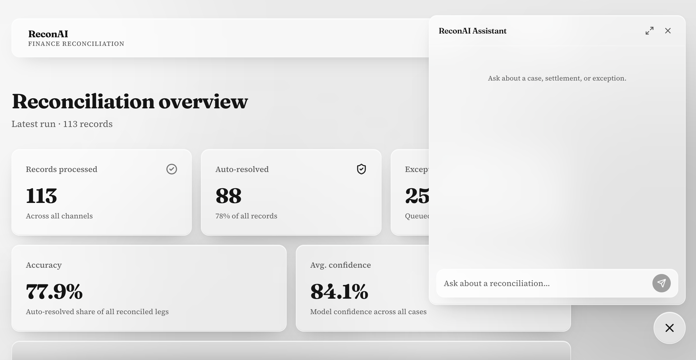

# [Recon AI](https://reconai-one.vercel.app/)

---

## Product Demonstration

[Click here to watch the demo on Youtube](https://www.youtube.com/watch?v=3baQbYvJ3Xo)

---

## The solution

ReconAI automates multi-source payment reconciliation and settlement QA for merchants. It addresses the manual effort and errors involved in identifying why the expected settlement differs from the actual bank settlement.
The AI agent:

- Reconciles transactions, provider settlements, and bank statements.
- Identifies adjustments such as provider fees, taxes, refunds, chargebacks, and other deductions.
- Uses deterministic tools to calculate expected settlements, compare amounts, validate currencies, detect duplicates, and match bank transactions.
- Explains the exact reason for a settlement difference instead of simply flagging a mismatch.
- Provides a confidence score and escalates genuinely unexplained cases as exceptions.

The goal is to reduce manual reconciliation effort, improve accuracy, and provide an auditable explanation for every settlement decision.

---

## Features

- A finance reconciliation dashboard to view the reconciliation status of the transactions.
- A reconciliation history to view the reconciliation history of the transactions.
- An AI agent to reconcile the transactions and provide the explanation for the settlement difference.

  
  

## Entity Relationship Diagram

The entity relationship diagram followed in the whole project:

---
